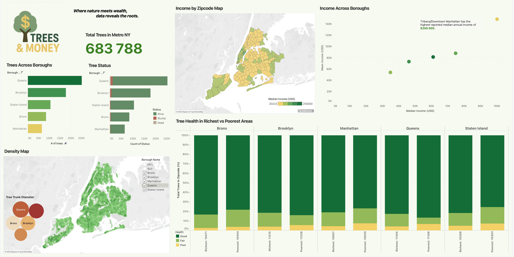

# NYC Tree Census and Income: Data Visualization by Tableau
***

### Author: Alexander K.

## Overview
This project explores the connection between urban nature and social inequality in New York City. Using publicly available datasets on tree census and median income, we'll trying to investigate whether wealthier neighborhoods have more, healthier, or younger trees compared to lower-income areas.

## Project Goals
The main goal of this project is to practice and strengthen data visualization skills by working with Tableau Public. Through building interactive dashboards and visual analyses, the project aims to reinforce understanding of data connections, design principles, and storytelling techniques within Tableau.

Some questions that are posed:

- A. How many trees are in metro NYC?
- B. How many trees are in each borough?
- C. What is the income of each borough?
- D. What is the income across different zip codes?
- E. What is the tree concentration across different zip codes?
- F. Does tree health vary across rich vs poor zip codes?
- G. Do certain boroughs have more living trees?
- H. Do certain boroughs have newer/younger trees?

## Actions

- made basic data visualizations, paying attention to narrative and argument in the data
- adjusted aesthetic properties to further a visual argument
- added labels and tooltips for clarity and interactivity
- filtered data to improve user experience
- presented visualizations as a cohesive, balanced dashboard

## Data

There are three [datasets](https://www.dropbox.com/scl/fi/f5yiwzkqeup24b36lcpxn/tree_money_datasets.zip?rlkey=kl2wgcfr3vgbjopqhwq247okh&dl=0) used in this project:

1. `tree-census-NYC_2015.csv` - NYC Tree Census
2. `tree_species_nyc.csv` - NYC Native Trees dataset
3. `income-NYC_2015.csv` - NYC Income data

## Results

The final visualizations and dashboards can be found on my [Tableau Public profile](https://public.tableau.com/views/TreeandMoney/TreesMoneyDashboard?:language=en-US&publish=yes&:sid=&:display_count=n&:origin=viz_share_link).